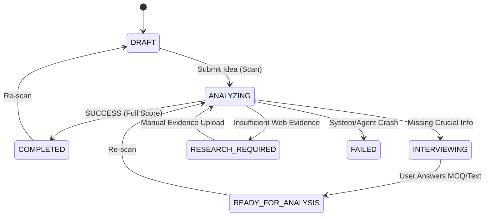

# QOOM V2.1 — Strategic Swarm Architecture (Fail-Closed)

This document outlines the architectural patterns, state transitions, security validators, and scoring algorithms implemented in QOOM V2.1.

---

## 1. Core Principles

1. **Fail-Closed by Design**: If any component of the multi-agent swarm fails, errors, or violates validation rules, the scan fails cleanly. No fallback "guess" dimensions or default scores are injected.
2. **Zero-Hallucination Enforced**: Specialists must rely strictly on the compiled `Evidence Pack`. Any specialist attempting to evaluate an idea as `PASS` without explicit, registered sources (e.g. relying only on LLM internal knowledge) is automatically flagged and rejected by the validator.
3. **Deterministic Calculations**: No random data points or arbitary numbers are generated. All scores, multipliers, and dynamic weights are calculated mathmatically from the agent outputs.

---

## 2. Unified State Machine

All statuses across the database, orchestration engines, queue managers, and frontend HUD are synchronized using the single source of truth: `packages/types/state-machine.ts`.

### Project Statuses (`ProjectStatus`)
- `DRAFT`: Newly created project description or scan failed.
- `INTERVIEWING`: Waiting for user response to clarifying questions.
- `READY_FOR_ANALYSIS`: User responded to questions, ready for scan execution.
- `ANALYZING`: Scan actively running in the background worker.
- `ANALYZED`: Scan finalized successfully, strategic report compiled.
- `FAILED`: Scan failed due to structural/evidence error.

### Scan Statuses (`ScanStatus`)
- `PENDING`: Initial state in the background BullMQ queue.
- `RUNNING`: Actively processing stages (Evidence gathering, agent execution).
- `INTERVIEWING`: Halted due to missing business metadata (requires user clarification).
- `RESEARCH_REQUIRED`: Halted due to insufficient external evidence packs (lacks search signals).
- `COMPLETED`: Successfully finished with a complete decision.
- `PARTIAL`: Finished but one or more non-critical specialist agents failed.
- `FAILED`: Terminal state when critical agents or system components failed.

### State Transitions Diagram

---

## 3. Strict Semantic Validator (`AgentResponseValidator`)

Every specialist agent response goes through 4 levels of validation in `AIResponseValidator.validateAgentResponseStrict`:

1. **Structure Check**: Verified against the appropriate Zod schema (e.g., `MarketAgentResponseSchema`).
2. **Dimension Check**: The agent must output dimensional scores (1-10) if they return `PASS` or `FAIL`.
3. **Zero-Hallucination Evidence Check**: If status is `PASS`, `evidenceUsed` must be non-empty.
4. **Security Check**: Scans for prompt injection keywords in the response to prevent jailbreak leakages.

If any check fails, the validator **throws an error** immediately. The agent will attempt a retry, and if all retries fail, it will be marked as `FAILED`.

---

## 4. Scoring Engine Formulas

Agent scores are calculated deterministically out of 100 based on their 1-10 dimensions:

- **MarketAgent**: `Math.round((demand + growth + market_size + urgency) * 2.5)`
- **CompetitionAgent**: `Math.round(((11 - competitor_count) + entry_barriers + differentiation + (11 - incumbent_threat)) * 2.5)`
- **MonetizationAgent**: `Math.round((pricing_power + ltv_to_cac + revenue_predictability + margins) * 2.5)`
- **FeasibilityAgent**: `Math.round((tech_readiness + mvp_timeline_score + team_availability + (11 - dependency_risk)) * 2.5)`
- **RiskAgent**: `Math.round(((11 - operational_risk) + (11 - financial_risk) + (11 - execution_risk) + (11 - adoption_risk)) * 2.5)`
- **RegulatoryAgent**: `Math.round(((11 - licensing_difficulty) + (11 - compliance_cost) + (11 - data_sovereignty_risk) + (11 - saudization_impact)) * 2.5)`

### Dynamic Weight Normalization

To compute the final score, only agents that successfully finished with a non-null score are considered:

$$\text{Final Score} = \text{round}\left( \frac{\sum_{i \in \text{Active}} \text{Score}_i \times \text{Weight}_i}{\sum_{i \in \text{Active}} \text{Weight}_i} \right)$$

If no agents yield valid scores, the Final Score is returned as `null`.

---

## 5. UI Decision Verdicts

The frontend maps the `ScanVerdict` and `ScanStatus` values to appropriate Arabic text and visual glows:

| Verdict String | Arabic Label | Color Theme |
|---|---|---|
| `PASS` | جاهز للتنفيذ | Emerald |
| `FAIL` | غير مؤهل | Rose |
| `PARTIAL` | تحليل جزئي | Amber |
| `INTERVIEWING` | بحاجة لتوضيحات | Cyan |
| `RESEARCH_REQUIRED` | بحاجة لأدلة | Violet |
